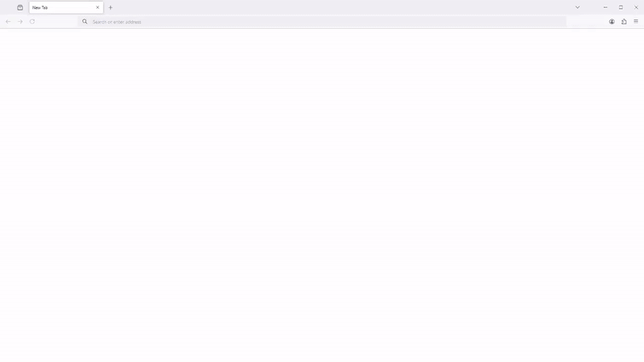

# Auto Browser

Auto Browser is a personal assistant designed to perform web actions via tools using Playwright. It includes functionalities to interact with web pages, extract elements, and enhance JSON data with robust XPath selectors.
(Supported APIs: OpenAI, XAI, Local Ollama Model)

What it's capable of - Some Examples:

Searching the web for information:

<div align="center">
    
</div>

Creating a todo-list:

<div align="center">
    
</div>

Posting on linkedin:

<div align="center">
    
</div>


## Installation

1. Clone the repository:
    ```sh
    git clone https://github.com/waltz47/Auto-Browser.git
    ```

2. Install the required dependencies:
    ```sh
    pip install -r requirements.txt
    ```

3. Set the `USER_DATA_DIR` environment variable to allow persistent browser use:
    ```sh
    export USER_DATA_DIR=/path/to/your/user/data/dir
    ```

4. Set the `OPENAI_API_KEY/XAI_API_KEY`.

5. Set the model to use in `api_config.cfg` for the relevant API. Defaults to gpt-4o for OpenAI and grok-2-beta for XAI.
   

## Usage

1. Start the AI worker:
    ```sh
    python run.py
    ```

2. Enter the prompt in the browser.

3. To change the AI behavior or to add specific details, you can add a custom prompt in `scripts/custom.log`

## How to Use Locally Installed Models via Ollama

1. Ensure Ollama is installed.
   
2. Ensure the required ollama model in api_config.cfg is present.(`ollama pull <model>`)

3. Run `ollama serve` in a terminal to start the ollama server.

4. Finally, start auto-browser with `python run.py`.
   
## Todo List

- [X] Allow Local Models Via Ollama
- [X] Add Vision
- [X] Make Logins Persistent
- [X] Custom Prompting
- [X] Add support for more APIs
- [X] Enhance error handling
- [ ] Fix Playwright Recording Video Resolution
- [ ] Allow Local File Access

## Contributing

Contributions are welcome!